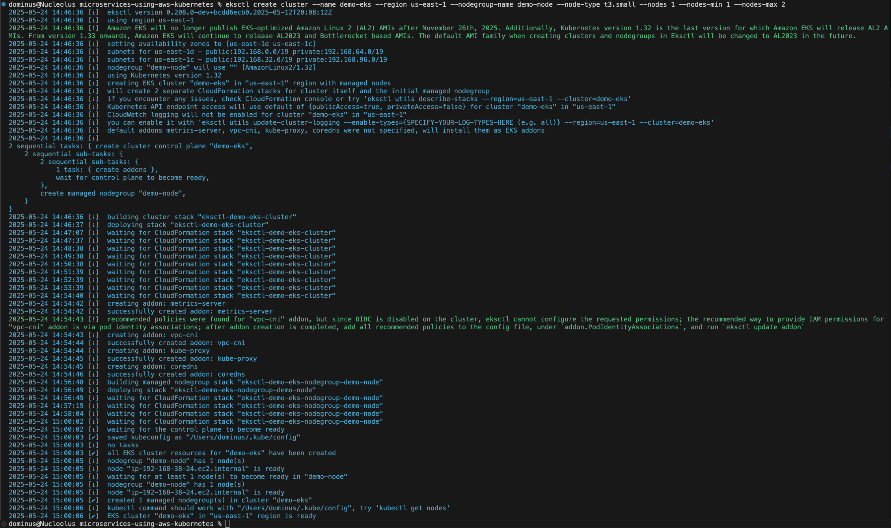
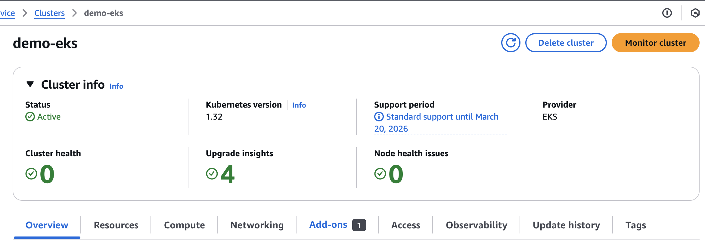
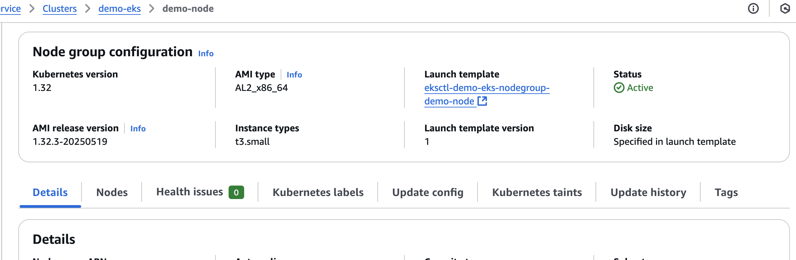

# microservices-using-aws-kubernetes

For this project, you are a DevOps engineer who will be collaborating with a team that is building an API for business analysts. The API provides business analysts basic analytics data on user activity in the service. The application they provide you functions as expected locally and you are expected to help build a pipeline to deploy it in Kubernetes.


## Getting Started

### Dependencies
#### Local Environment
1. Python Environment - run Python 3.6+ applications and install Python dependencies via `pip`
2. Docker CLI - build and run Docker images locally
3. `kubectl` - run commands against a Kubernetes cluster
4. `helm` - apply Helm Charts to a Kubernetes cluster
5. `eksctl` - create and manage Kubernetes clusters on AWS
6. `awscli` - interact with AWS services from the command line
7. `git` - clone repositories and manage source code

#### Local Resources
1. Docker Desktop - run a local Kubernetes cluster
2. Python 3.6+ - run Python applications
3. AWS CLI - authenticate with AWS resources

#### Remote Resources
1. AWS CodeBuild - build Docker images remotely
2. AWS ECR - host Docker images
3. Kubernetes Environment with AWS EKS - run applications in k8s
4. AWS CloudWatch - monitor activity and logs in EKS
5. GitHub - pull and clone code


#### Check your AWS IAM configuration

Verify your AWS user or role is currently authenticated
```bash
aws sts get-caller-identity
```

If you have an error you have to configure it properly by executing this command
```bash
aws configure
```

#### Create EKS Cluster and Nodes

Here is the command to create cluster named demo-eks and node named demo-node:

```bash
eksctl create cluster --name demo-eks --region us-east-1 --nodegroup-name demo-node --node-type t3.small --nodes 1 --nodes-min 1 --nodes-max 2
```








#### Update the context in the local Kubeconfig file
```bash
aws eks --region us-east-1 update-kubeconfig --name demo-eks
```


### Configure a postgres database for the service

#### Create PersistentVolumeClaim
Create a file pvc.yaml on your local machine, with the following content.


#### Delete EKS Cluster
```bash
eksctl delete cluster --name demo-eks --region us-east-1
```
