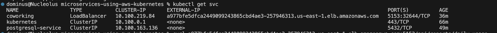
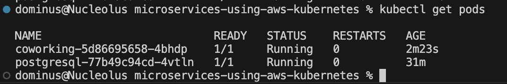
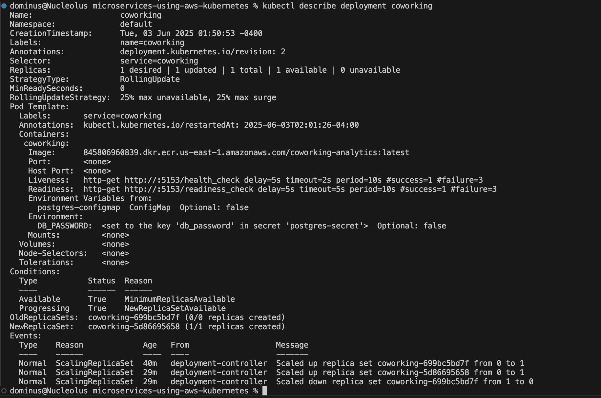

# microservices-using-aws-kubernetes

For this project, you are a DevOps engineer who will be collaborating with a team that is building an API for business analysts. The API provides business analysts basic analytics data on user activity in the service. The application they provide you functions as expected locally and you are expected to help build a pipeline to deploy it in Kubernetes.


## Getting Started

### Dependencies
#### Local Environment
1. Python Environment - run Python 3.6+ applications and install Python dependencies via `pip`
2. Docker CLI - build and run Docker images locally
3. `kubectl` - run commands against a Kubernetes cluster
4. `helm` - apply Helm Charts to a Kubernetes cluster
5. `eksctl` - create and manage Kubernetes clusters on AWS
6. `awscli` - interact with AWS services from the command line
7. `git` - clone repositories and manage source code

#### Local Resources
1. Docker Desktop - run a local Kubernetes cluster
2. Python 3.6+ - run Python applications
3. AWS CLI - authenticate with AWS resources

#### Remote Resources
1. AWS CodeBuild - build Docker images remotely
2. AWS ECR - host Docker images
3. Kubernetes Environment with AWS EKS - run applications in k8s
4. AWS CloudWatch - monitor activity and logs in EKS
5. GitHub - pull and clone code


#### Check your AWS IAM configuration

Verify your AWS user or role is currently authenticated

```bash
aws sts get-caller-identity
```

If you have an error you have to configure it properly by executing this command

```bash
aws configure
```

#### Create EKS Cluster and Nodes

Here is the command to create cluster named demo-eks and node named demo-node:

<i>For example, we choose as cluster name `demo-eks` and the node name `demo-node`</i> 

```bash
eksctl create cluster --name demo-eks --region us-east-1 --nodegroup-name demo-node --node-type t3.small --nodes 1 --nodes-min 1 --nodes-max 2
```


#### Update the context in the local Kubeconfig file

```bash
aws eks --region us-east-1 update-kubeconfig --name demo-eks
```


### Setup
#### Configure a postgres database
Set up a Postgres database using a Helm Chart.

1. Install PostgreSQL Helm Chart

```
helm install <SERVICE_NAME> <REPO_NAME>/postgresql
```

This should set up a Postgre deployment at `<SERVICE_NAME>-postgresql.default.svc.cluster.local` in your Kubernetes cluster. You can verify it by running `kubectl get svc`

By default, it will create a username `myuser`. The password can be retrieved with the following command:

```bash
export POSTGRES_PASSWORD=$(kubectl get secret --namespace default <SERVICE_NAME>-postgresql -o jsonpath="{.data.postgres-password}" | base64 -d)

echo $POSTGRES_PASSWORD
```

<sup><sub>* The instructions are adapted from [Bitnami's PostgreSQL Helm Chart](https://artifacthub.io/packages/helm/bitnami/postgresql).</sub></sup>

2. Test Database Connection
The database is accessible within the cluster. This means that when you will have some issues connecting to it via your local environment. You can either connect to a pod that has access to the cluster _or_ connect remotely via [`Port Forwarding`](https://kubernetes.io/docs/tasks/access-application-cluster/port-forward-access-application-cluster/)

* Connecting Via Port Forwarding

```bash
kubectl port-forward --namespace default svc/<SERVICE_NAME>-postgresql 5432:5432 &
    PGPASSWORD="$POSTGRES_PASSWORD" psql --host 127.0.0.1 -U postgres -d postgres -p 5432
```

* Connecting Via a Pod

```bash
kubectl exec -it <POD_NAME> bash
PGPASSWORD="<PASSWORD HERE>" psql postgres://postgres@<SERVICE_NAME>:5432/postgres -c <COMMAND_HERE>
```

3. Run Seed Files
We will need to run the seed files in `db/` in order to create the tables and populate them with data.

```bash
kubectl port-forward --namespace default svc/<SERVICE_NAME> 5432:5432 &
    PGPASSWORD="$POSTGRES_PASSWORD" psql --host 127.0.0.1 -U postgres -d postgres -p 5432 < <FILE_NAME.sql>
```

Here in `db` directory, you will replace <FILE_NAME.sql> in the command above by each one sql filenames and execute
- [1_create_tables.sql](db/1_create_tables.sql)
- [2_seed_users.sql](db/2_seed_users.sql)
- [3_seed_tokens.sql](db/3_seed_tokens.sql)

#### Running the Analytics Application Locally
In the `analytics/` directory:

1. Install dependencies

```bash
pip install -r requirements.txt
```

2. Run the application (see below regarding environment variables)

```bash
<ENV_VARS> python app.py
```

There are multiple ways to set environment variables in a command. They can be set per session by running `export KEY=VAL` in the command line or they can be prepended into your command.

* `DB_USERNAME` (defaults to `myuser`)
* `DB_PASSWORD` (defaults to `mypassword`)
* `DB_HOST` (defaults to `127.0.0.1`)
* `DB_PORT` (defaults to `5432`)
* `DB_NAME` (defaults to `mydatabase`)

Feel free to change default values

If we set the environment variables by prepending them, it would look like the following:

```bash
DB_USERNAME=username_here DB_PASSWORD=password_here python app.py
```

The benefit here is that it's explicitly set. However, note that the `DB_PASSWORD` value is now recorded in the session's history in plaintext. There are several ways to work around this including setting environment variables in a file and sourcing them in a terminal session.


### Some results screenshoted 

#### When you build the image on docker in local 


#### Here is how to generate reports for dialy usage and user visitings


#### AWS Codebuild 


#### AWS ECR (Elastic Container Registry) repository


#### Get services  


#### Get pods


#### Describe svc database 


#### Describe deployment


#### AWS CloudWatch for application logs


### Cleaning up resources to save on costs
#### Delete EKS Cluster
This should delete cluster, nodes and all dependences (or relative resources) it created when we run the creation command

```bash
eksctl delete cluster --name demo-eks --region us-east-1
```


#### Delete all others stuffs created
You should delete all others like: 
- `AWS Codebuild`
- `AWS ECR repository`
- `AWS IAM` and `roles` created 
